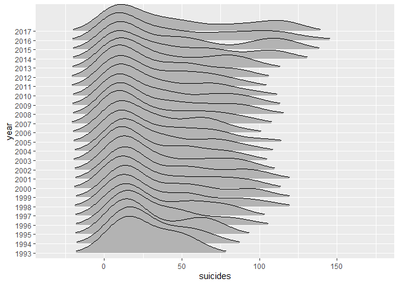

```r
# libraries 
library(tidyverse)
```

```
## Warning: package 'tidyverse' was built under R version 3.5.3
```

```
## -- Attaching packages --------------------------------------- tidyverse 1.2.1 --
```

```
## v ggplot2 3.2.0     v purrr   0.3.2
## v tibble  2.1.3     v dplyr   0.8.2
## v tidyr   0.8.3     v stringr 1.4.0
## v readr   1.3.1     v forcats 0.4.0
```

```
## Warning: package 'ggplot2' was built under R version 3.5.3
```

```
## Warning: package 'tibble' was built under R version 3.5.3
```

```
## Warning: package 'tidyr' was built under R version 3.5.3
```

```
## Warning: package 'purrr' was built under R version 3.5.3
```

```
## Warning: package 'dplyr' was built under R version 3.5.3
```

```
## Warning: package 'forcats' was built under R version 3.5.3
```

```
## -- Conflicts ------------------------------------------ tidyverse_conflicts() --
## x dplyr::filter() masks stats::filter()
## x dplyr::lag()    masks stats::lag()
```

```r
#install.packages("ggridges")
library(ggplot2)
library(ggridges)
```

```
## Warning: package 'ggridges' was built under R version 3.5.3
```

```
## 
## Attaching package: 'ggridges'
```

```
## The following object is masked from 'package:ggplot2':
## 
##     scale_discrete_manual
```


```r
# Download the Data
url="https://www.ons.gov.uk/visualisations/dvc661/drugs/datadownload.csv"
suicide_stats <- readr::read_csv(url)
```

```
## Parsed with column specification:
## cols(
##   .default = col_double(),
##   Age = col_character()
## )
```

```
## See spec(...) for full column specifications.
```


```r
# reshape data into "tidy" format
suicide_stats_tidy <- suicide_stats %>% 
  gather("year","suicides",2:26)
```


```r
suicide_stats_tidy %>%
  ggplot(aes(x=suicides,y=year))+ 
  geom_density_ridges(scale=4,rel_min_height = 0.05)
```

```
## Picking joint bandwidth of 11.2
```

<!-- -->


